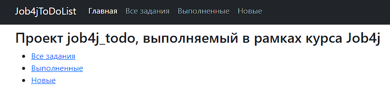
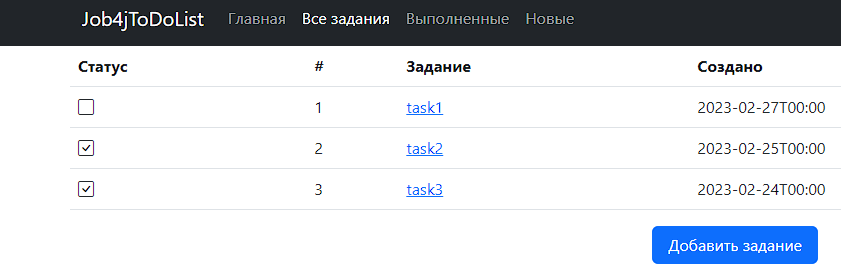
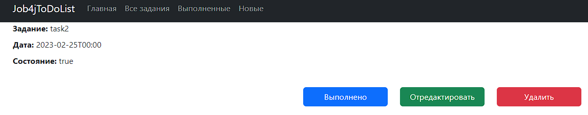
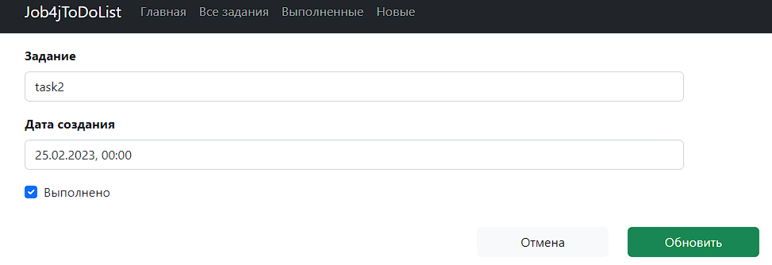

# job4j_todo
Список заданий

# Описание
Управление списком заданий. Создание, изменение, удаление. Название, дата создания, состояние.

# Стек технологий
- Java 17;
- PostgreSQL 14;
- Spring Boot 2;
- Thymeleaf 3;
- Bootstrap 5;
- Hibernate 5;
- Liquibase 4;
- Lombok 1.

# Требования к окружению
- Java 17;
- Maven 3.8;
- PostgreSQL 14.

# Запуск проекта
1. Создать БД: ```create database todo```.
2. Запустить приложение из класса Main.
3. Запустить браузер и открыть главную страницу: ```http://localhost:8080/index```.

# Взаимодействие с приложением
- главная страница:

- страница со списком всех заданий:

- страница с подробным описанием задания:

- страница для редактирования задания:


# Контакты
andrew76k@rambler.ru